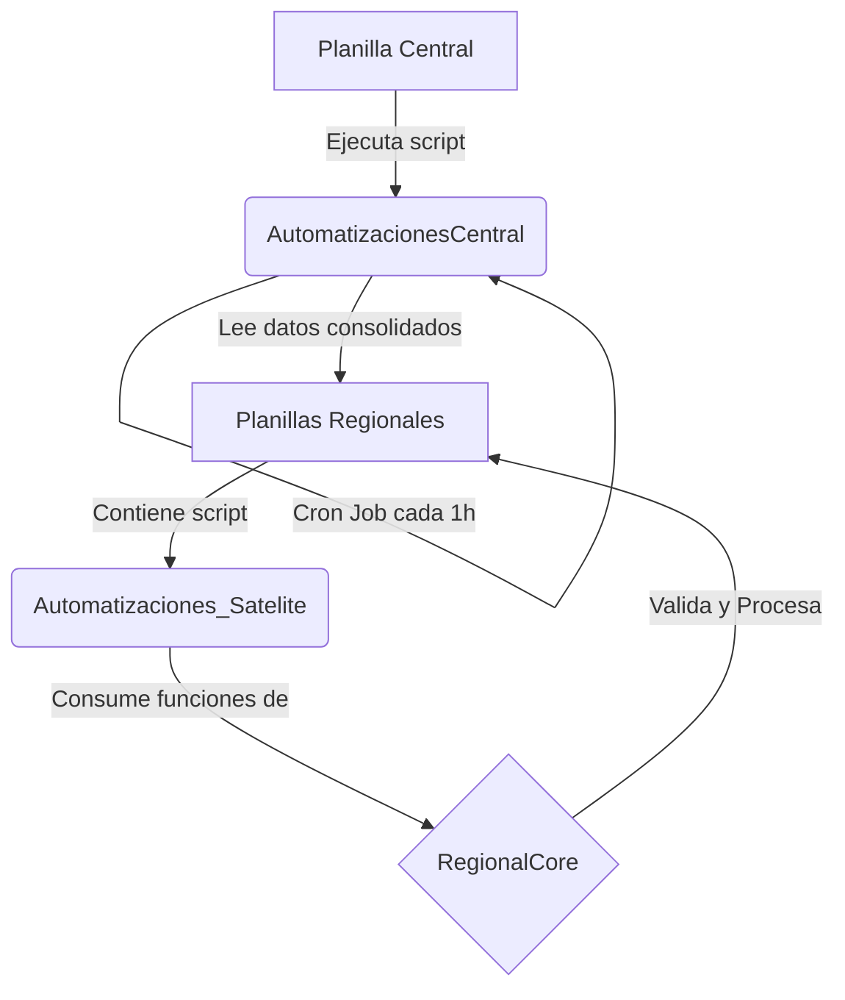

# Ecosistema Google Apps Script (GAS)

**Sistema:** Red de Automatización y Sincronización de Datos Regionales.
**Arquitectura:** Cliente-Servidor (Librería Distribuida).
**Estado:** Producción / Crítico.

## 🗺️ Mapa de Arquitectura

Este no es un sistema monolítico. Funciona mediante la interconexión de scripts distribuidos en diferentes planillas de Google Sheets.

> **NOTA CRÍTICA:** La carpeta `03-automatizacion-satelite` es inservible sin la librería `02-regional-core` correctamente vinculada.

---

## 📂 Descripción de Módulos

### 1. `02-regional-core` (Librería Maestra)
* **Rol:** El "Cerebro" lógico de las regiones.
* **Ubicación Real:** Proyecto de Script independiente (Standalone).
* **Función:** Contiene toda la lógica de validación, menús, actualización de roles y gestión de activadores instalables.
* **⚠️ Requisito de Restauración:** Debe desplegarse como **Biblioteca (Library)** para que otros scripts puedan llamarla.

### 2. `03-automatizacion-satelite` (Cliente Ligero / Wrapper)
* **Rol:** El "Puente" o interfaz.
* **Ubicación Real:** Insertado en cada una de las Planillas Regionales (Script del contenedor).
* **Función:**
    * `onOpen`: Dibuja el menú en la hoja llamando a `RegionalCore.iniciarMenuRegional()`.
    * `Wrappers`: Funciones puente (ej: `setRegionSTGO`, `procesarPendientesTodo`) que redirigen al usuario a la librería maestra.
* **⚠️ Requisito de Restauración:** Requiere agregar manualmente el **Script ID** de `RegionalCore` en la sección "Bibliotecas" del editor con el identificador `RegionalCore`.

### 3. `01-automatizacion-central` (Orquestador)
* **Rol:** Sincronizador Global.
* **Ubicación Real:** Planilla Central (Master).
* **Función:** Recorre las planillas satélites y consolida la información periódicamente.
* **⚠️ Requisito de Restauración:** Requiere configuración manual de un **Activador por Tiempo (Time-driven Trigger)** para ejecutarse cada hora (minuto 25).

### 4. `04-planilla-etl` (Herramientas)
* **Rol:** Limpieza de datos.
* **Ubicación Real:** Planilla de Pre-carga / Normalización.
* **Función:** Scripts utilitarios para normalizar bases de datos externas antes de ingresarlas al sistema.

---

## 🚨 Guía de Recuperación de Desastres (Disaster Recovery)

Si se borran todos los proyectos de Apps Script, sigue este orden **ESTRICTO** para restaurar el servicio:

### PASO 1: Restaurar el Núcleo (`RegionalCore`)
1.  Crea un nuevo proyecto de Apps Script independiente.
2.  Copia el código de la carpeta `02-regional-core`.
3.  Guarda y despliega una **Nueva Versión** (Gestionar versiones).
4.  Ve a Configuración del proyecto y **copia el "Script ID"**.

### PASO 2: Reconectar los Satélites (`Automatizacion_Satelite`)
1.  En la planilla regional, abre el editor de secuencia de comandos.
2.  Copia el código de `03-automatizacion-satelite`.
3.  En la barra izquierda, haz clic en **Bibliotecas (+) > Añadir una biblioteca**.
4.  Pega el **Script ID** del Paso 1.
5.  **IMPORTANTE:** Configura el identificador como `RegionalCore` (Respeta mayúsculas y minúsculas).
6.  Guarda el proyecto.

### PASO 3: Reactivar el Sincronizador (`Automatizacion_Central`)
1.  En la planilla central, restaura el código de `01-automatizacion-central`.
2.  Ve a la sección **Activadores (Reloj)** en la barra izquierda.
3.  Añade un activador nuevo (+).
4.  Configura:
    * **Función:** `automataPorHora` (o nombre equivalente).
    * **Fuente del evento:** Basado en tiempo.
    * **Tipo de activador:** Temporizador por hora.
    * **Intervalo:** Cada hora.

---

## 📞 Diagnóstico Rápido

| Síntoma | Causa Probable | Solución |
| :--- | :--- | :--- |
| **Error "RegionalCore is not defined"** | Falta vincular la librería en el script satélite. | Ver PASO 2. |
| **Menú no aparece en hoja regional** | Fallo en `onOpen` o librería desconectada. | Revisar `Code.gs` en satélite y recargar hoja. |
| **Datos no llegan a la central** | El Trigger de tiempo se detuvo o fue borrado. | Ver PASO 3 (Activadores). |
| **Error de permisos** | El usuario nuevo no ha autorizado los scripts. | Ejecutar cualquier función manualmente una vez para aceptar permisos. |
